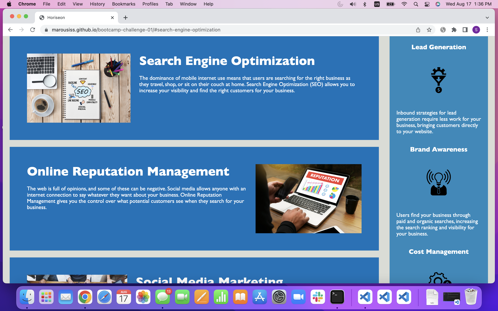
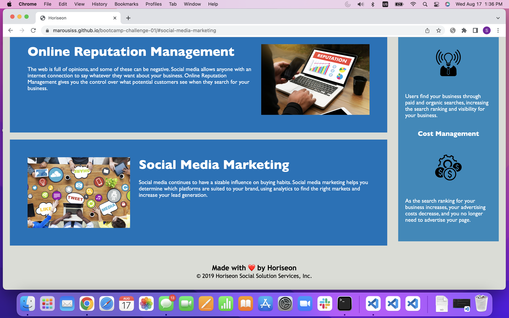

# Horiseon Webpage

## Description

The Horiseon webpage is built to provide information about its marketing services. By vising the page, the users will have the opportunity to learn more about the agency's services for adverising their products. They will be informed about Search Engine Optimization(SEO), Online reputation Management, and Social Marketing technics. The visitors will also learn about the benefits that come with using these types of services.

## Installation

N/A

## Usage

[Link to Horiseon Webpage](https://marousiss.github.io/code-refactor/)

Webpage screenshots:

## Credits

N/A

## License

Please refer to the LICENSE in the repo.
